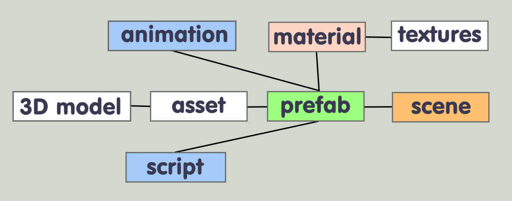
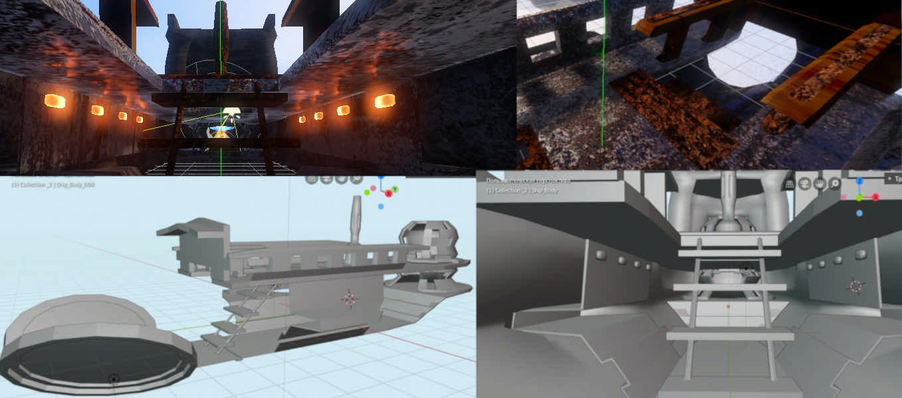
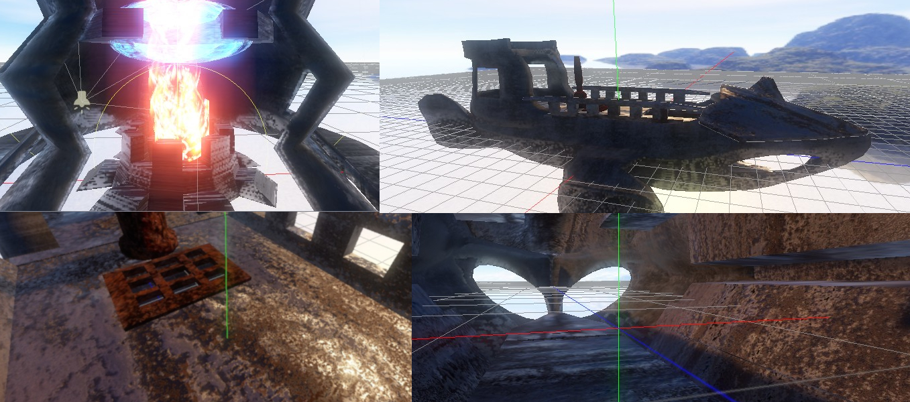

# Old Flying Ship - GODOT Engine 3D Demo Project #

## Introduction ##
Today [GODOT](https://godotengine.org/) is the most convenient and logical engine in the world.

And the most unknown among game developers.

Demonstration of the graphic capabilities of the engine. Textures and materials for projects.

Used GODOT 3.1.1

## What will be included ##
+ TEXTURES
+ MATERIALS
+ ANIMATION TRECS
+ PARTICLES SISTEMS
+ FPS CONTROLLER
+ ENVIROMENT MAP
+ PREFABS
+ 3D MODELS
+ CANVAS
### Limitation ###
+ Textures size no more than 1024px. I hope this made the project easier and helped launch it on a different hardware.
+ You can only use textures as part of a product. And never separately. This condition was established by the manufacturer (s) of the original photo materials from which the textures are made.
# How to use #
Just copy the folders you need into your project. For example, the materials folder and the textures folder. Or prefab and all its components.

General scheme of ways.

## License ##
All components from the content creator are MIT licensed.
### Who ###

Created by Magicus Art Studio. Sergey Mikhaylov.

 [Magicus Art Studio Site](https://magicus-art.com/)
## Progress ##

08.10.2019

08.01.2019
## Credits and thanks ##
+ The project used the basic script from the package
 [Maujoe / godot-camera-control Script](https://github.com/Maujoe/godot-camera-control) and basic script from package
  [ashrafulislambd/fpscontroller](https://github.com/ashrafulislambd/fpscontroller).
MIT License. The text of the license  [can be found here](https://github.com/godotengine/godot/blob/master/LICENSE.txt)
+ Textures created with [Materialize](https://github.com/BoundingBoxSoftware/Materialize)
+ We like [Blender](https://www.blender.org/)
### Future ###
Magicus Art Studio plans to create a project on this engine.
