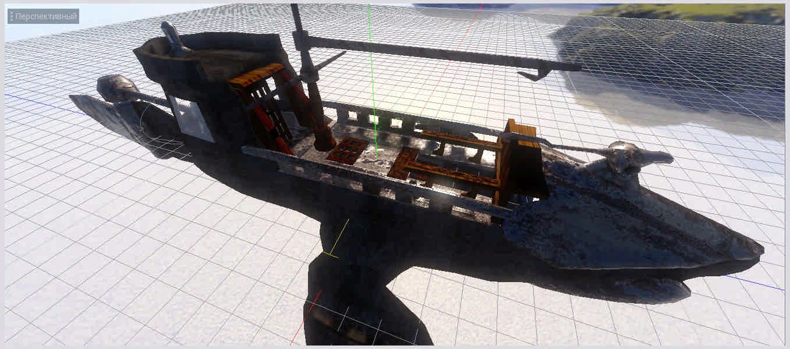

# Old Flying Ship - GODOT Engine 3D Demo Project #

## Oops and goodbye ##
The project did not open in GODOT 3.2.
There are materials, textures and other things for developers.

Used GODOT 3.1.1

# How to use #
Just copy the folders you need into your project. For example, the materials folder and the textures folder. Or prefab and all its components.

General scheme of ways.

## License ##
All components from the content creator are MIT licensed.
### Who ###

Created by Magicus Art Studio. Sergey Mikhaylov.

 [Magicus Art Studio Site](https://magicus-art.com/)
## Progress ##

08.19.2019

08.10.2019

08.01.2019
## Credits and thanks ##
+ The project used the basic script from the package
 [Maujoe / godot-camera-control Script](https://github.com/Maujoe/godot-camera-control) and basic script from package
  [ashrafulislambd/fpscontroller](https://github.com/ashrafulislambd/fpscontroller).
MIT License. The text of the license  [can be found here](https://github.com/godotengine/godot/blob/master/LICENSE.txt)
+ Textures created with [Materialize](https://github.com/BoundingBoxSoftware/Materialize)
+ We like [Blender](https://www.blender.org/)
